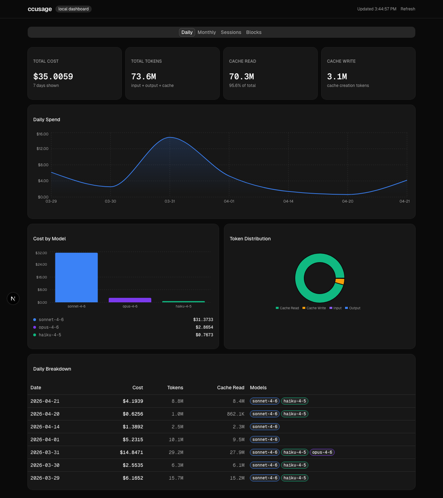
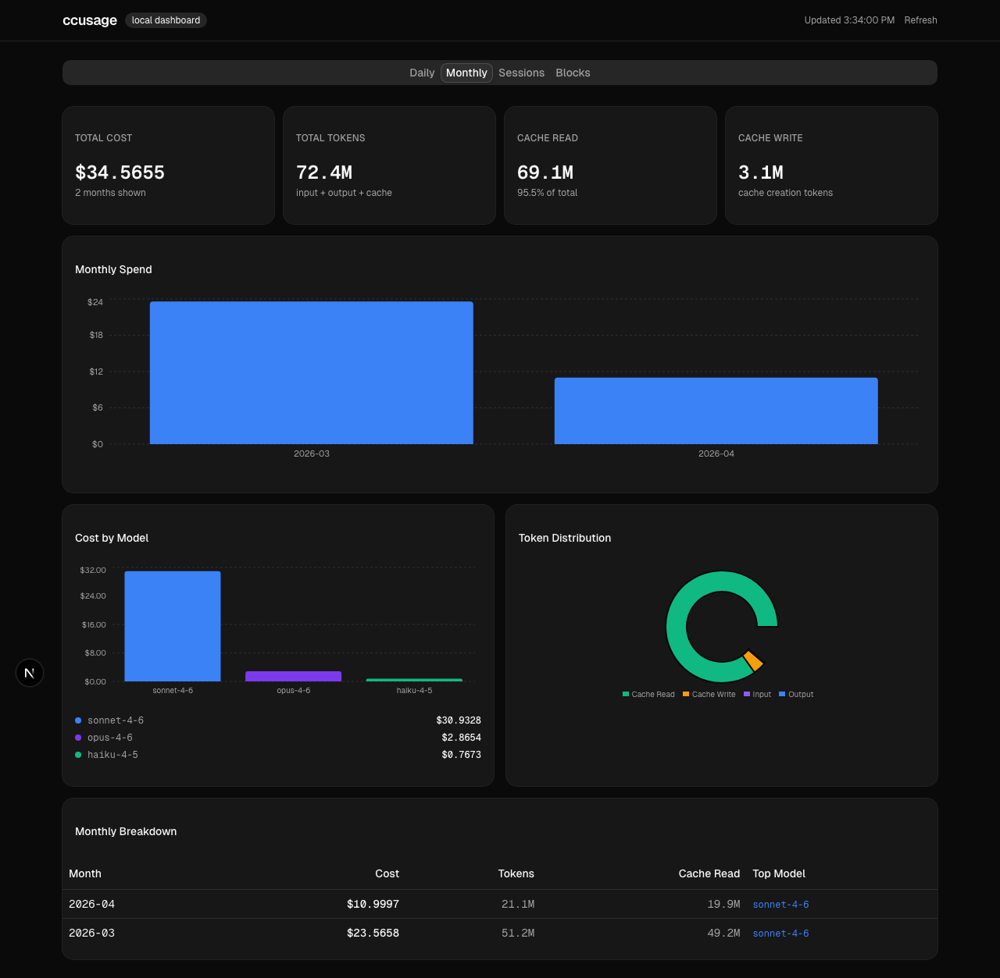
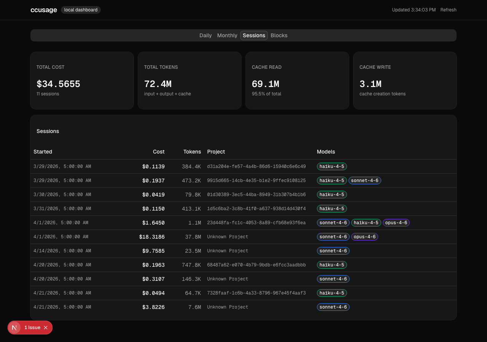
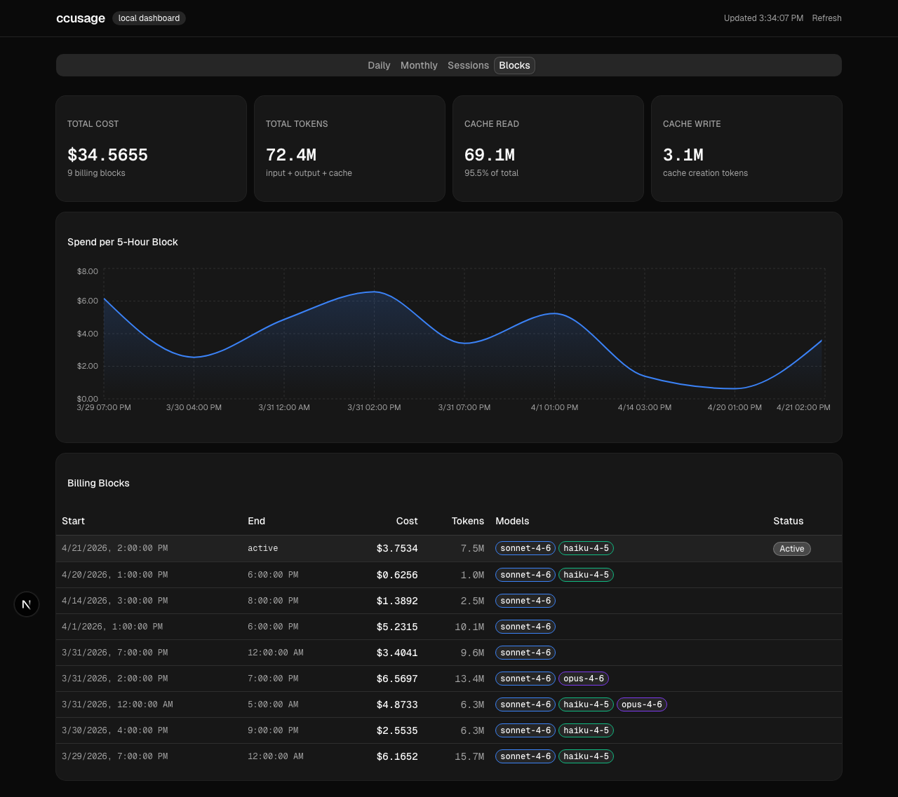

# ccusage-web

A local web dashboard for monitoring your Claude Code token usage and costs — built on top of the [`ccusage`](https://www.npmjs.com/package/ccusage) CLI.

| Daily view | Monthly view |
|-----------|--------------|
|  |  |

| Sessions view | Blocks view |
|--------------|-------------|
|  |  |

## Why a web dashboard instead of the terminal?

The `ccusage` CLI is great for quick one-off checks. The web dashboard gives you something persistent and visual to keep open alongside your work.

| Feature | `ccusage` CLI | `ccusage-web` |
|---------|--------------|---------------|
| Spend over time | Text table | Interactive area/bar charts |
| Model cost breakdown | `--breakdown` flag | Always-visible bar chart + legend |
| Token type split (input / output / cache) | Not shown by default | Donut chart on every view |
| Navigate between time ranges | Re-run command each time | Click tabs — Daily · Monthly · Sessions · Blocks |
| Keep watching usage | Manual reruns | Auto-refreshes every 2 minutes |
| Zero typing once open | Every check needs a new command | One browser tab |

## What it shows

- **Daily view** — spend per day with a trend chart, per-model badges, and a full breakdown table
- **Monthly view** — bar chart of month-over-month spend with top-model callouts
- **Sessions view** — per-project session costs sorted by recency
- **Blocks view** — 5-hour billing window tracking (the same windows Claude Code uses for rate limiting), with an active-block indicator

Each view includes:
- Overview stat cards: total cost, total tokens, cache read %, cache write tokens
- Cost-by-model bar chart with color-coded model labels
- Token distribution donut (cache read · cache write · output · input)

## Requirements

- Node.js 18+
- [`ccusage`](https://www.npmjs.com/package/ccusage) installed globally, **or** `npx` available (falls back automatically)
- Claude Code must have run at least once so `~/.claude/projects/` exists with usage data

## Quick start

```bash
# Run directly without installing (builds on first run, ~30s)
npx ccusage-web

# Or install globally for instant starts
npm install -g ccusage-web
ccusage-web
```

Your browser opens automatically at `http://localhost:3000`.

## Development

```bash
git clone https://github.com/hamzaahmedkhan/ccusage-web
cd ccusage-web
npm install
npm run dev           # hot-reload dev server on localhost:3000
npm run screenshots   # re-capture docs/ screenshots (requires server running)
```

## How it works

The dashboard runs entirely on your machine. A single API route (`/api/usage`) shells out to `ccusage <view> --json` and normalises the output for the frontend. No data leaves your machine — it reads the same `~/.claude/projects/*.jsonl` files that `ccusage` uses.

## Tech stack

- [Next.js 16](https://nextjs.org) · [shadcn/ui](https://ui.shadcn.com) · [Recharts](https://recharts.org) · [ccusage](https://www.npmjs.com/package/ccusage)

## License

MIT
